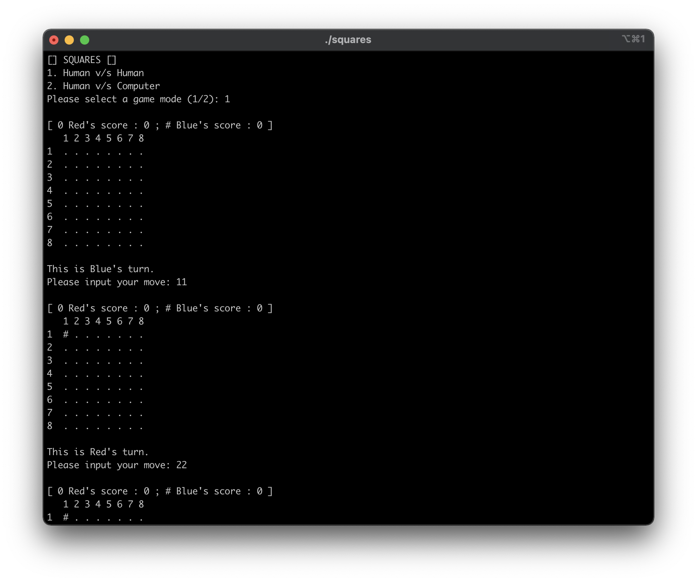
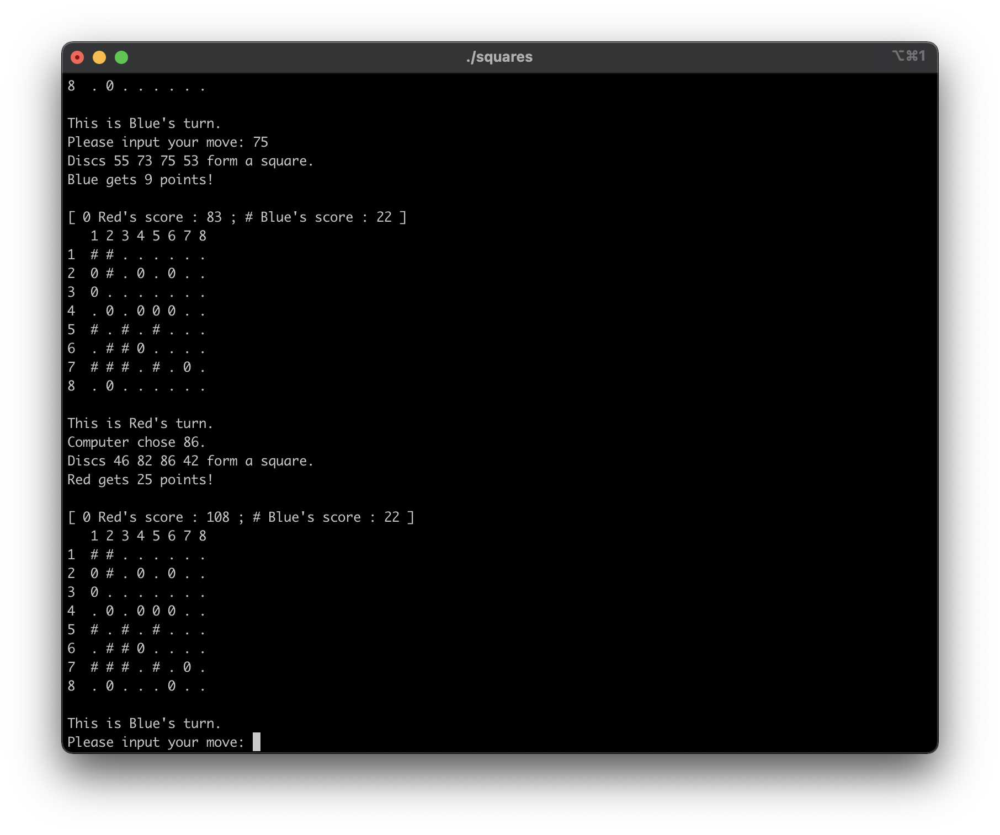
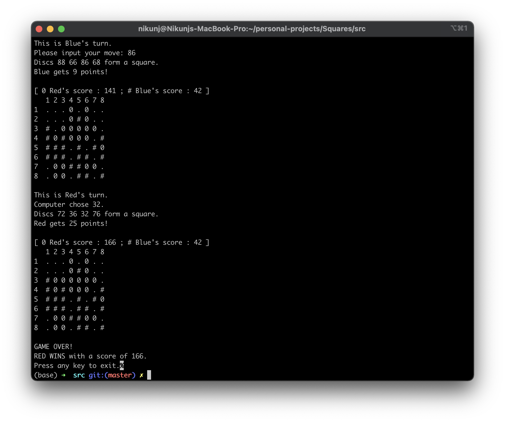

# Squares

A MetaSquares clone built in C.
<br>
This is a two player board game with simple rules and deep strategy, developed as a part of my freshman year programming course. The game is adapted from the online flash version available <a href="http://www.fastswf.com/2wsAnK8">here</a>. The game was originally designed by <a href="http://www.scottkim.com/">Scott Kim</a>.

Squares is a CLI application with 2 game modes:
* Human v/s Human
* Human v/s Computer

## Getting Started

These instructions will help you build and run the game on your local machine. You will need to clone the repository using git (or download and extract the zip file), build the source files using gcc and finally, run the game.

```
$ git clone https://github.com/nikunj-taneja/squares.git && cd squares
$ gcc -Wall main.c game.c helpers.c -o squares
$ ./squares
```

## Screenshots





## Rules

The game takes place on an 8 x 8 game board with 64 cells where each cell can hold a disc. There are two kinds of discs represented as below: 
* Red – denoted by `0`
* Blue – denoted by `#`

Players place their discs alternatively on the game board, one using the red disc and the other using blue with blue playing first. The goal of the game is to form as many squares (preferably large) as possible using the discs. Larger square corresponds to higher points. The points of a given square are calculated by the following formula:
```
points = (n)^2
```
where `n` is the total number of columns (and equivalently, rows) that the square covers. In each turn, a player must place only one disc. If the disc placed doesn't form any squares, the player gets zero points.

The game ends in the follwing situations:
* The game board is full, in which case the player with the higher score wins (it's a draw if the scores are equal).
* one of the player gets over 150 points with at least 15 points higher than their opponent.
